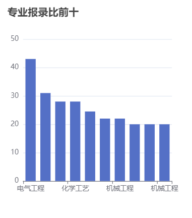
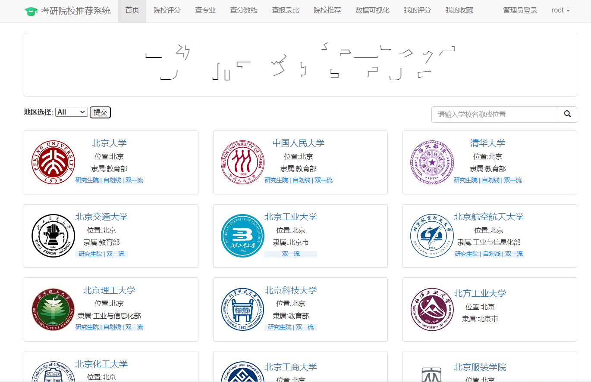

## 计算机毕业设计Django+Vue.js考研推荐系统 考研分数线预测 中公考研爬虫 混合神经网络推荐算法 考研可视化 机器学习 深度学习 大数据毕业设计 Hadoop PySpark 机器学习 深度学习 Python Scrapy分布式爬虫 机器学习 大数据毕业设计 数据仓库 大数据毕业设计 文本分类 LSTM情感分析 大数据毕业设计 知识图谱 大数据毕业设计 预测系统 实时计算 离线计算 数据仓库 人工智能 神经网络

## 要求
### 源码有偿！一套(论文 PPT 源码+sql脚本+教程)

### 
### 加好友前帮忙start一下，并备注github有偿纯python考研
### 我的QQ号是2827724252或者798059319或者 1679232425或者微信:bysj2023nb 或bysj1688

# 

### 加qq好友说明（被部分 网友整得心力交瘁）：
    1.加好友务必按照格式备注
    2.避免浪费各自的时间！
    3.当“客服”不容易，repo 主是体面人，不爆粗，性格好，文明人。

演示视频

https://www.bilibili.com/video/BV1hz42187rv/?spm_id_from=333.999.0.0

## 开发技术：
一、项目概述
考研（研究生入学考试）是许多大学毕业生追求深造的一种途径。为了帮助考生更好地选择适合自己的研究生专业和院校，开发一个考研推荐系统可以为考生提供个性化的建议。该项目旨在通过数据分析和可视化技术，为考生提供基于数据的研究生专业和院校推荐。
通过数据分析和可视化，为考生提供具有个性化的研究生专业和院校推荐服务，帮助考生更好地选择适合自己的研究生方向。
该项目涉及数据处理、统计分析和可视化等技术，需要结合数据库管理、数据清洗、数据分析工具和可视化库进行开发实现。
二、大数据分析、挖掘与可视化开发环境
    本项目采用Python语言及第三方库进行大数据分析、挖掘，包括训练模型的构建、后端开发环境、使用的第三方库和模型评估等方面。
1.软件开发环境：PyCharm、Navicat、MySQL
2.第三方库包
django==2.2.1
django-simpleui==2.1
djangorestframework==3.9.1
pandas
requests
Beautifulsoup4
pyecharts
三、数据采集
本项目爬虫由两个爬虫同时组成，并可以并行爬取数据。
其中一个爬虫用于采集研究生院校的基本信息，包括学校名称、地理位置、专业设置等。另一个爬虫用于采集历年考研数据，包括报考人数、录取人数、专业录取分数线等。爬虫可以通过网络请求和HTML解析的方式获取所需数据，并将数据保存到本地csv文件或数据库中。
四、数据准备（含数据清洗、补全、整合、转换等）
在数据准备阶段，对采集到的数据进行清洗、补全、整合和转换等处理操作，以确保数据的质量和一致性。这包括处理缺失值、异常值、重复值等，对数据进行格式转换和标准化，以及将不同来源的数据整合到一个统一的数据集中。项目中所爬取的最新考研录取人数存在未知，且爬取下来的字段为-字符串，故将其修改为0.
五、数据分析处理与训练模型的构建
在数据分析方面，我们分析了院校收藏Top10和院校评分Top10。统计了院校数量、双一流院校数量、自划线院校数量排名前十的省份。对专业报录比、学校报录比、学校报名前十做了统计分析。
在基于学校评分和收藏的模型构建阶段，我们将利用学生对不同学校的评分和收藏数据来构建推荐模型。这些评分和收藏数据可以反映学生对学校的偏好和兴趣。
六、模型评估
数据准备：
收集学生对不同学校的评分和收藏数据。
对数据进行清洗和预处理，处理缺失值、异常值等。
特征工程：
根据评分和收藏数据，提取相关的特征，如学校评分、收藏次数等。
进行特征选择和转换，以提取对模型训练有用的特征。
模型评估：
基于准备好的特征和数据集，使用自定义算法构建推荐模型。
将数据集分为训练集和测试集，并评估模型的性能和准确性。
根据评估结果，对模型进行调整和改进，以提高推荐准确性和用户满意度。
模型优化：
可以尝试不同的机器学习算法、模型参数和特征组合，以优化模型表现。
进行模型调优和参数调整，以提高推荐结果的准确性和个性化程度。

七、数据可视化
数据可视化是将数据分析结果以直观、易于理解的图表、图形等形式展示的过程。在这一阶段，可以使用数据可视化技术，如绘制柱状图、折线图、散点图等，来展示分析结果和模型预测的信息。通过交互式界面和图表，用户可以根据自身需求进行筛选和选择，从而更好地理解和利用数据分析结果。
本项目使用柱状图分析了院校收藏和评分前十，饼状图统计了院校总数量、双一流院校数量、自划线院校数量前十的省份。最好，通过柱状图分析了每个院校及专业报录比前十情况，可以得出哪些院校或者哪些专业竞争比较激烈。

!
以下文字解释recommend.py，也就是推荐模块，比较长，不方便念。
1. 计算基于用户收藏的 Jaccard 相似度
这个函数的目的是计算当前用户与其他用户之间的 Jaccard 相似度，基于他们的收藏行为。Jaccard 相似度是通过计算两个集合的交集元素数量与并集元素数量之间的比值来衡量的。

功能:
首先，该函数获取了当前用户收藏的学校，然后根据这些学校构建了一个收藏向量，向量中的每个元素代表一个学校的收藏情况。如果用户收藏了某个学校，则在向量中相应的位置上置1，否则为0。
接着，遍历除了当前用户之外的所有其他用户。对每个用户，获取其收藏的学校，构建一个收藏向量，然后计算当前用户与其他用户之间的 Jaccard 相似度。
最后，将与当前用户相似度大于给定阈值的用户及其相似度存储在一个字典中并返回。
2. 基于用户收藏计算当前用户对邻居收藏院校的 Jaccard 兴趣度
python
Copy code
def user_recommendations_jaccard_collections(user_id, similarities, similarities_jaccard):
    # 获取当前用户的收藏数据
    user_collections = UserCollection.objects.filter(user_id=user_id).values('school_id', 'collection')
    # 获取当前用户收藏的学校id
    user_collections_school_id = [user_collection['school_id'] for user_collection in user_collections]

    recommendations_jaccard = {}
    # 邻居用户已收藏的学校中目标用户未收藏的学校
    for school_id in UserCollection.objects.filter(user_id__in=similarities).exclude(
            school_id__in=user_collections_school_id).values_list('school_id', flat=True).distinct():
        # 获取收藏了当前物品的用户:用户id和收藏情况（collection = 1）
        item_collections = UserCollection.objects.filter(school_id=school_id).values('user_id', 'collection')

        # 初始化一个空列表
        weighted_scores = []

        # 遍历 item_collections 中的每一条记录
        for collection in item_collections:
            # 如果该收藏记录对应的用户在 similarities_jaccard 字典中，则计算该收藏记录对该物品的权重得分
            if collection['user_id'] in similarities_jaccard:
                # 获取该收藏记录对应用户与目标用户的相似度
                similarity = similarities_jaccard[collection['user_id']]
                # 计算该收藏记录对该物品的权重得分
                weighted_score = similarity * collection['collection']
                # 将该权重得分添加到列表中
                weighted_scores.append(weighted_score)

        numerator = sum(weighted_scores)
        denominator = sum(similarities_jaccard.values())
        if denominator > 0:
            recommendations_jaccard[school_id] = round(numerator / denominator, 2)
    return recommendations_jaccard
功能:
这个函数的目的是计算当前用户对邻居收藏院校的 Jaccard 兴趣度。该兴趣度是基于当前用户与邻居用户的相似度以及邻居用户对学校的收藏情况计算的。
该函数首先检索当前用户的收藏数据，并构建了一个收藏向量，表示用户收藏的情况。
接着，遍历所有邻居用户收藏的学校，计算当前用户对这些学校的兴趣度得分，并存储在一个字典中以便返回。
2. 基于用户评分计算相似度的函数
2.1. 基于用户评分计算当前用户与其他用户的余弦相似度
python
Copy code
def user_cosine_similarity_ratings(user_id, default_similarity_cosine=0):
    # 获取当前用户评分数据
    user_ratings = UserScore.objects.filter(user_id=user_id).values('school_id', 'score')
    user_ratings_school_id = [user_rating['school_id'] for user_rating in user_ratings]

    # 构造当前用户评分向量
    user_rating_vector = [0 for i in range(999)]
    for school_id, score in user_ratings:
        user_rating_vector[school_id] = score

    similarities_cosine = {}
    for user in User.objects.exclude(id=user_id):
        # 获取当前用户与其他用户共同评价的物品的评分数据
        ratings = user.userscores.filter(school_id__in=user_ratings_school_id).values('school_id', 'score')
        if ratings:  # 如果当前用户与该用户有共同评分的学校，则计算当前用户与该用户的相似度，这里使用余弦相似度
            # 获取该用户所有的评分学校的评分情况：(school_id,score)
            ratings = user.userscores.filter().values('school_id', 'score')
            ratings_school = [(rating['school_id'], rating['score']) for rating in ratings]

            # 构造该用户评分向量：rating_vector
            rating_vector = [0 for i in range(999)]
            for school_id, score in ratings_school:
                rating_vector[school_id] = score

            # 计算两用户之间的余弦相似度
            similarity_cosine = cosine_similarity(user_rating_vector, rating_vector)
            if similarity_cosine > default_similarity_cosine:
                similarities_cosine[user.id] = similarity_cosine
    return similarities_cosine
功能:
这个函数的目的是计算当前用户与其他用户之间的余弦相似度，基于他们的评分行为。余弦相似度是通过计算两个向量的夹角余弦值来衡量的。
首先，该函数获取了当前用户的评分数据，然后根据这些评分构建了一个评分向量，向量中的每个元素代表一个学校的评分情况。如果用户对某个学校进行了评分，则在向量中相应的位置上记录该评分，否则为0。
接着，遍历除了当前用户之外的所有其他用户。对每个用户，获取其评分的学校，构建一个评分向量，然后计算当前用户与其他用户之间的余弦相似度。
最后，将与当前用户相似度大于给定阈值的用户及其相似度存储在一个字典中并返回。
2.2. 基于用户评分计算当前用户对邻居评分院校的余弦兴趣度
python
Copy code
def user_recommendations_cosine_ratings(user_id, similarities, similarities_cosine):
    # 获取当前用户评分数据
    user_ratings = UserScore.objects.filter(user_id=user_id).values('school_id', 'score')
    user_ratings_school_id = [user_rating['school_id'] for user_rating in user_ratings]

    recommendations_cosine = {}

    # 邻居用户已评分的学校中目标用户未评分的学校
    for school_id in UserScore.objects.filter(user_id__in=similarities).exclude(
            school_id__in=user_ratings_school_id).values_list('school_id', flat=True).distinct():
        # 获取评价了当前物品的用户和评分数据
        item_ratings = UserScore.objects.filter(school_id=school_id).values('user_id', 'score')

        # 初始化一个空列表
        weighted_scores = []

        # 遍历 item_ratings 中的每一条记录
        for rating in item_ratings:
            # 如果该评分记录对应的用户在 similarities_cosine 字典中，则计算该评分记录对该物品的权重得分
            if rating['user_id'] in similarities_cosine:
                # 获取该评分记录对应用户与目标用户的相似度
                similarity = similarities_cosine[rating['user_id']]
                # 计算该评分记录对该物品的权重得分
                weighted_score = similarity * rating['score']
                # 将该权重得分添加到列表中
                weighted_scores.append(weighted_score)

        numerator = sum(weighted_scores)
        denominator = sum(similarities_cosine.values())
        if denominator > 0:
            recommendations_cosine[school_id] = round(numerator / denominator, 2)
    return recommendations_cosine
功能:
这个函数的目的是计算当前用户对邻居评分院校的余弦兴趣度。该兴趣度是基于当前用户与邻居用户的相似度以及邻居用户对学校的评分情况计算的。
该函数首先检索当前用户的评分数据，并构建了一个评分向量，表示用户评分的情况。
接着，遍历所有邻居用户评分的学校，计算当前用户对这些学校的兴趣度得分，并存储在一个字典中以便返回。
3. 计算相似度的函数
3.1. Jaccard 相似度计算函数
功能：

这个函数用于计算两个向量之间的 Jaccard 相似度。
通过将布尔向量转换为集合，它计算两个集合的交集和并集的大小，并据此计算相似度。
3.2. 重载字典计算方法
功能：

这个类重载了字典的加法和乘法运算符，以支持字典之间的加法和乘法操作。
3.3. 余弦相似度计算函数
功能：

这个函数用于计算两个向量之间的余弦相似度。
计算两个向量的内积作为分子，两个向量模长的乘积作为分母，然后计算相似度。
4. 基于用户收藏计算相似度的函数
4.1. 计算基于用户收藏的 Jaccard 相似度
功能:

这个函数的目的是计算当前用户与其他用户之间的 Jaccard 相似度，基于他们的收藏行为。
首先，该函数获取了当前用户收藏的学校，然后根据这些学校构建了一个收藏向量，向量中的每个元素代表一个学校的收藏情况。如果用户收藏了某个学校，则在向量中相应的位置上置1，否则为0。
接着，遍历除了当前用户之外的所有其他用户。对每个用户，获取其收藏的学校，构建一个收藏向量，然后计算当前用户与其他用户之间的 Jaccard 相似度。
最后，将与当前用户相似度大于给定阈值的用户及其相似度存储在一个字典中并返回。
4.2. 基于用户收藏计算当前用户对邻居收藏院校的 Jaccard 兴趣度
功能:

这个函数的目的是计算当前用户对邻居收藏院校的 Jaccard 兴趣度。该兴趣度是基于当前用户与邻居用户的相似度以及邻居用户对学校的收藏情况计算的。
该函数首先检索当前用户的收藏数据，并构建了一个收藏向量，表示用户收藏的情况。
接着，遍历所有邻居用户收藏的学校，计算当前用户对这些学校的兴趣度得分，并存储在一个字典中以便返回。
5. 基于用户评分计算相似度的函数
5.1. 基于用户评分计算当前用户与其他用户的余弦相似度
功能:

这个函数的目的是计算当前用户与其他用户之间的余弦相似度，基于他们的评分行为。余弦相似度是通过计算两个向量的夹角余弦值来衡量的。
首先，该函数获取了当前用户的评分数据，然后根据这些评分构建了一个评分向量，向量中的每个元素代表一个学校的评分情况。如果用户对某个学校进行了评分，则在向量中相应的位置上记录该评分，否则为0。
接着，遍历除了当前用户之外的所有其他用户。对每个用户，获取其评分的学校，构建一个评分向量，然后计算当前用户与其他用户之间的余弦相似度。
最后，将与当前用户相似度大于给定阈值的用户及其相似度存储在一个字典中并返回。
5.2. 基于用户评分计算当前用户对邻居评分院校的余弦兴趣度
功能:

这个函数的目的是计算当前用户对邻居评分院校的余弦兴趣度。该兴趣度是基于当前用户与邻居用户的相似度以及邻居用户对学校的评分情况计算的。
该函数首先检索当前用户的评分数据，并构建了一个评分向量，表示用户评分的情况。
接着，遍历所有邻居用户评分的学校，计算当前用户对这些学校的兴趣度得分，并存储在一个字典中以便返回。

